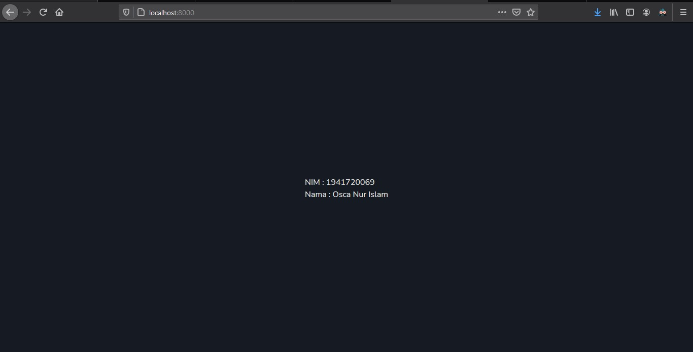

# 01 - Hello World

## Tujuan Pembelajaran

1. 
(-)Mahasiswa mampu melakukan instalasi dan konfigurasi Laravel
(-)Mahasiswa mampu mengubah tampilan welcome di Laravel

## Hasil Praktikum

Tambah setelah dirubah 

[kode program](../../src/01_hello_world/welcome.blade.php)
