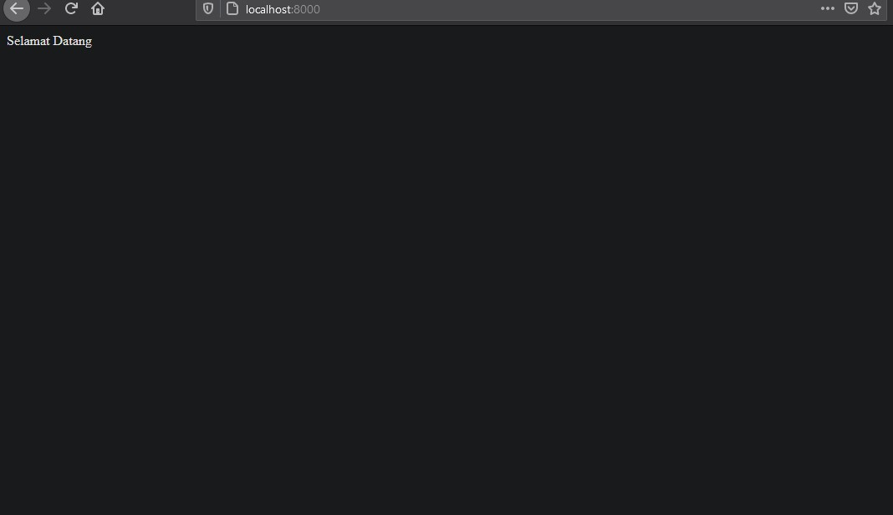
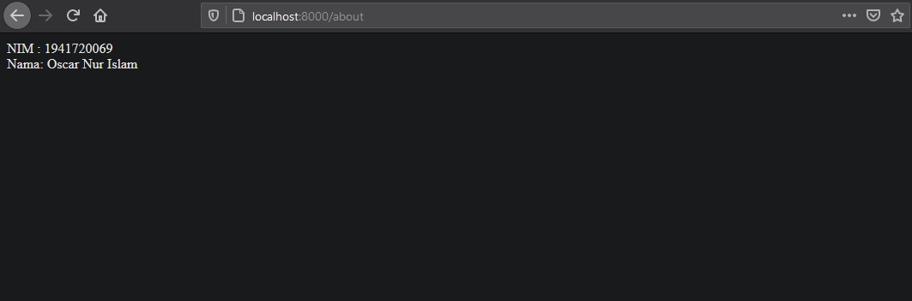
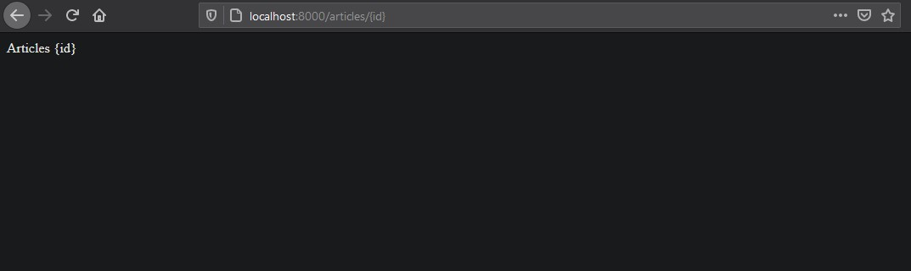
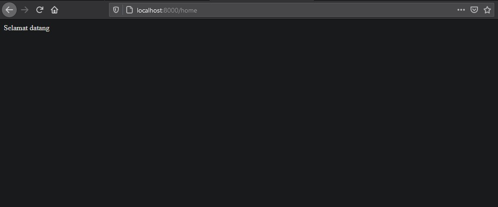
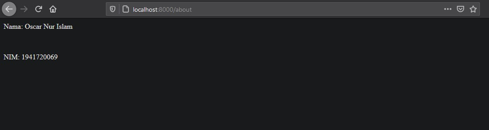
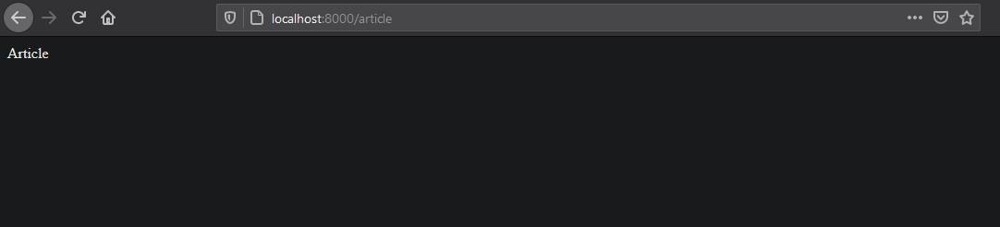

# 02 - Routing dan Controller

## Tujuan Pembelajaran

1. Mahasiswa memahami konsep routing laravel web framework
2. Mahasiswa menerapkan routing pada laravel web framework
3. Mahasiswa memahami konsep controller laravel web framework
4. Mahasiswa menerapkan controller pada laravel web framework

## Hasil Praktikum

### praktikum 1:

[kode program](../../src/02_routing_controller/Praktikum-1/web.php)

### praktikum 2:

[kode program about](../../src/02_routing_controller/Praktikum-2/AboutController.php)  
[kode program article](../../src/02_routing_controller/Praktikum-2/ArticleController.php)  
[kode program controller](../../src/02_routing_controller/Praktikum-2/Controller.php)  
[kode program Home Controller](../../src/02_routing_controller/Praktikum-2/HomeController.php)  
[kode program Page Controller](../../src/02_routing_controller/Praktikum-2/PageController.php)  
[kode program web](../../src/02_routing_controller/Praktikum-2/web.php) 