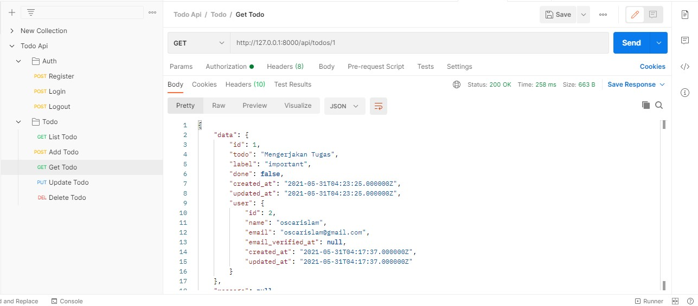

# 11 - Todo API

### Praktikum 1

##### tampilan regristasi

##### tampilan database setelah regristasi

##### tampilan login

##### tampilan logout

##### tampilan database logout

### Praktikum 2

##### tampilan list todo

##### tampilan add todo

##### tampilan get todo

##### tampilan update todo

##### tampilan get todo

##### tampilan get todo

